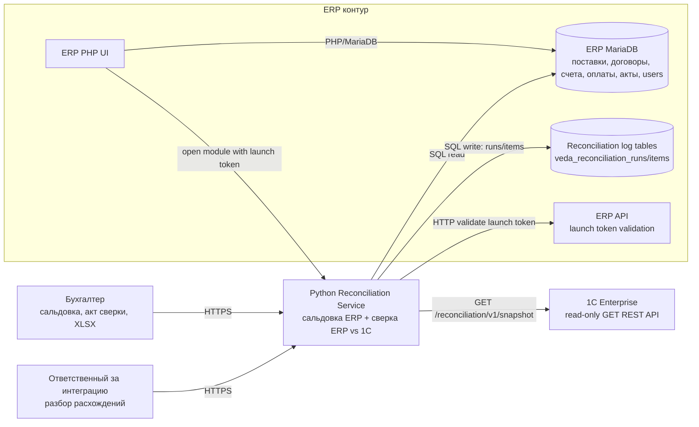
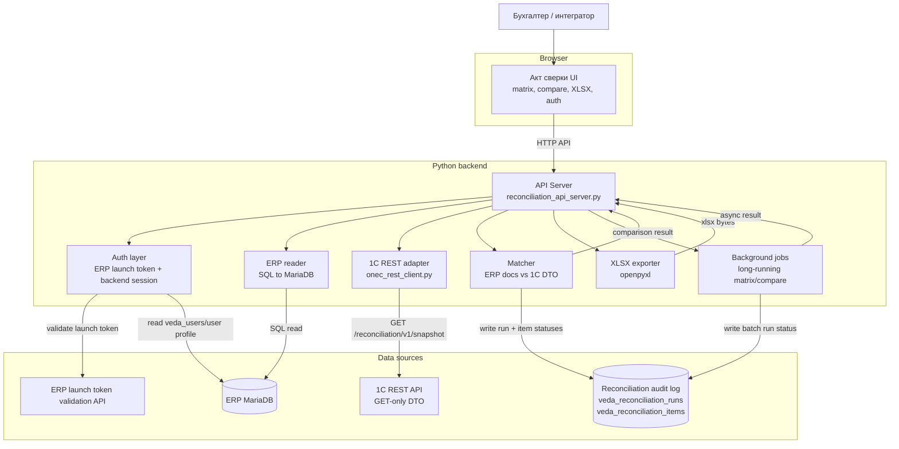
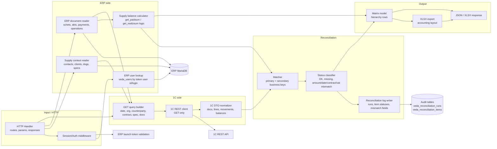
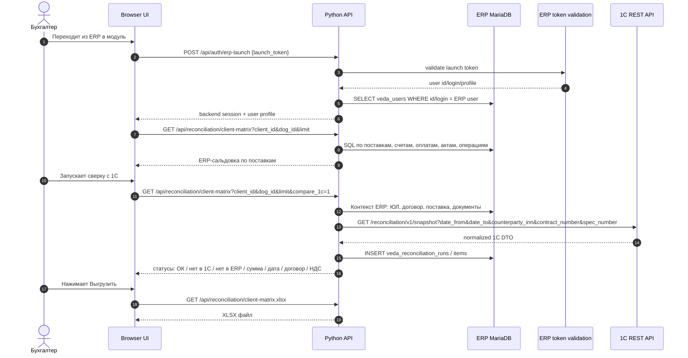
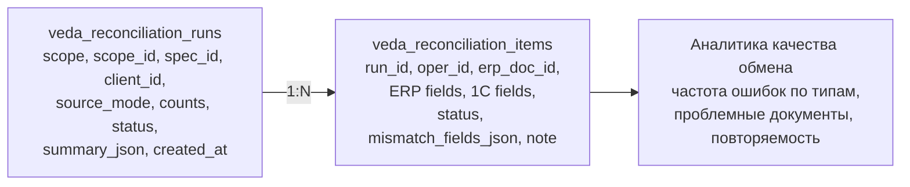

# C4 Architecture: ERP vs 1C Reconciliation

## Назначение

Сервис закрывает два разных пользовательских сценария:

1. **Сальдовка по поставкам внутри ERP**: бухгалтер видит счета покупателю, оплаты, возмещаемые расходы, невозмещаемые расходы, переплату или долг по поставке и выгружает XLSX.
2. **Сверка ERP vs 1C**: бухгалтер или ответственный за интеграцию видит, какие документы есть в обеих системах, какие отсутствуют и где расходятся сумма, дата, номер, договор, НДС или аналитика поставки.

Backend реализуется на Python. ERP PHP остается рабочей системой и источником пользовательского контекста: при переходе в модуль из ERP, ERP передает короткоживущий launch token, backend валидирует его в ERP и создает внутреннюю сессию. Модуль сверки читает ERP напрямую из MariaDB и читает 1C через read-only GET REST API.

Диаграммы ниже оформлены в C4-уровнях, но используют обычный Mermaid `flowchart`, чтобы линии не пересекались и схема была компактнее.

## Level 1. System Context

## Level 2. Containers

## Level 3. Python Backend Components

## Runtime Flow. Login, Matrix, Compare, Export

## Ключевые архитектурные правила

- **Сальдовка по поставкам** и **сверка ERP vs 1C** - разные сценарии. Сальдовка отвечает “сколько по поставке”, сверка отвечает “что выгружено, чего нет и что разошлось”.
- Live-матрица не должна автоматически считать всю историю клиента. Пользователь выбирает клиента/ЮЛ/договор и ограничение поставок.
- 1C API только read-only и GET-only. Основной endpoint: `GET /reconciliation/v1/snapshot`.
- Python backend передает в 1C только query-фильтры: период, организация, контрагент, договор, поставка, коды/номера документов, `include`, `cursor`, `limit`.
- Пользователь не проходит отдельный внешний вход. Доступ открывается только из ERP по короткоживущему launch token.
- Backend session создается после валидации launch token в ERP. ERP token не хранится в URL и не используется как публичный долгоживущий секрет.
- Для больших объемов используется background runner и collection endpoints с `cursor`/`limit`.
- Все запуски сверки пишутся в `veda_reconciliation_runs`.
- Все документные результаты и расхождения пишутся в `veda_reconciliation_items`.
- Документы сопоставляются по бизнес-ключу `тип документа + код 1C + дата 1C + договор 1C`; матч только по коду 1C запрещен из-за дублей.
- Расхождения логируются типизированно: `MISSING_IN_ERP`, `MISSING_IN_1C`, `AMOUNT_MISMATCH`, `DATE_MISMATCH`, `NUMBER_MISMATCH`, `CONTRACT_MISMATCH`, `VAT_MISMATCH`, `DUPLICATE_IN_1C`, `AMBIGUOUS_MATCH`, `SOURCE_ERROR`.

## Persistent Log Model

Лог используется не как технический debug-log, а как бизнес-аудит сверки: когда запускали, по какому объекту, сколько документов сравнили, какие типы расхождений получили и какие поля не совпали.
